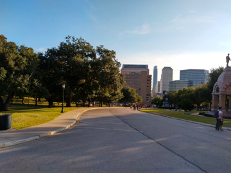

# Image recognition

Image recognition is a set of techniques where image (or video) is described using textual labels, words describing the image.
For more technical description on image recongition systems as well as guidelines how to build ones own, see ([Williams et al., 2020](https://www.cambridge.org/core/elements/images-as-data-for-social-science-research/0376EE8A7A21F5B47FC4EC24DF07EFE9))

For Google Vision, an image recognition service, labels this image with: Daytime, Sky, City, Public Space, Human Settlement, Road, Residential Area, Urban Area, Asphalt, Metropolitan Area, Tree, Infra-structure, Park, Road Surface, Downtown, Architecture, Neighbourhood, Skyline, Real Estate, Thoroughfare, Building, Suburb, Urban Design, Street, Lane, Walkway, Cloud, Recreation, Plaza, Town Square, Sidewalk, Nonbuilding Structure.
For Microsoft Azure, another image recognition service, the image is about Outdoor, Road, Street, City, Grass, Sitting, Empty, Red, View, Side, Stop, Green, Traffic, Sign, Track, Yellow, Park, Tall, Bench, Parked, Train, Hydrant, Riding, Bus.

## Image recognition services

Instead of building image recognition services, it is possible to use existing services such as

* [Google Vision AI](https://cloud.google.com/vision)
* [Microsoft Azure Computer Vision](https://azure.microsoft.com/en-us/services/cognitive-services/computer-vision/)
* [AWS Rekognition](https://aws.amazon.com/rekognition/) - no easy-to use demo

Most of these services require some level of programming skills to make them useful for a large quantity of images.
(Our team is working on easy-to-use application for social scientists, for details, please contact matti.nelimarkka@helsinki.fi to be a pilot user.)
Both Google Vision AI and Microsoft Azure Computer Vision have a demo tool which allows you to try out a few images in these services.

There are some costs related to using these services.
If you plan to use them on a research project, remember to budget them into the costs of the project work.
You may also apply for a research grant from the platform owners to cover such costs via their academic collaboration program ([Amazon](https://aws.amazon.com/government-education/research-and-technical-computing/cloud-credit-for-research/), [Google](https://edu.google.com/programs/credits/research/), [Microsoft](https://www.microsoft.com/en-us/research/academic-programs/)).
