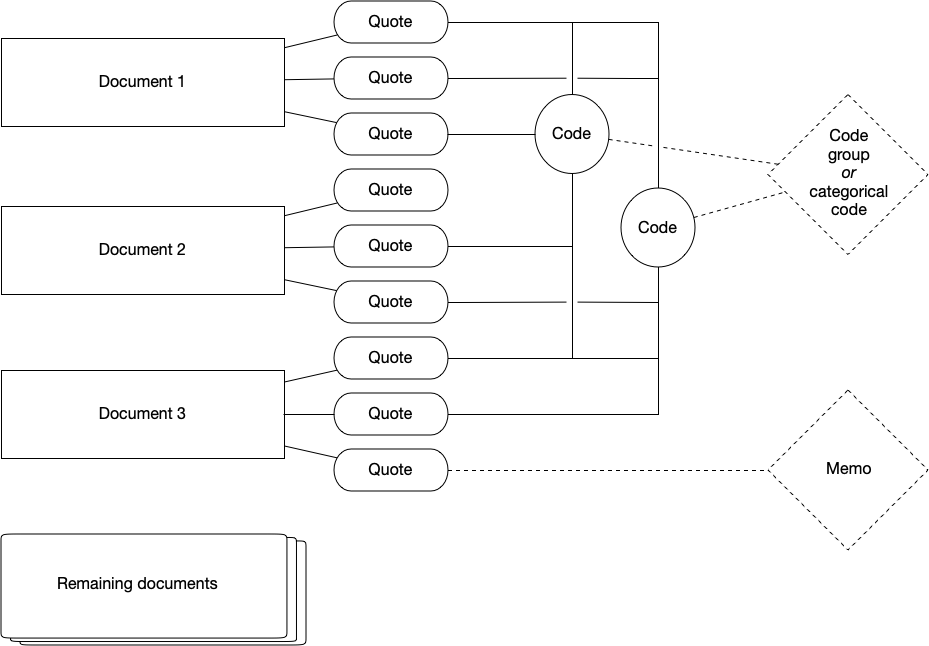

# ATLAS.ti

ATLAS.ti is one of many software available to assist with qualitative analysis.
It specially excels in open coding, i.e., attaching interpretations and concepts to the material during the analysis stage.

## Installation

### Licence for the software

You will need a licence to use Atlas.TI.
University of Helsinki provides licence for its students and faculty.
To see this information, choose the right operating system and if you use a computer owned by the university or if its a personal computer:

Affiliation | Operating system | Whose computer | Installation guide
- | - | - | -
University of Helsinki | Mac | University of Helsinki | Install from [Managed Software Center](https://helpdesk.it.helsinki.fi/en/instructions/computer-and-printing/software/installation-universitys-mac-software).
University of Helsinki | Mac | Personal computer | Install from [Download Centre](https://helpdesk.it.helsinki.fi/en/instructions/computer-and-printing/software-download-center/new-download-centre).
University of Helsinki | Windows | University of Helsinki | Install from [Software Center](https://helpdesk.it.helsinki.fi/en/instructions/computer-and-printing/software/software-center).
University of Helsinki | Windows | Personal computer | Install from [Download Centre](https://helpdesk.it.helsinki.fi/en/instructions/computer-and-printing/software-download-center/new-download-centre).

### Web and desktop software

ATLAS.ti allows one to use both a desktop software and an online version available via [their website](https://web.atlasti.com/) similar to Google Docs.
At this time, they do not automatically synchronise and you are only able to _export_ a web based project, not import a project into it.

Therefore, you need to choose before doing data analysis if you prefer to work on the web-based version or on the desktop version.

ATLAS.ti Web is perfect for collaborative work: you can conduct annotations on the data together, access code manager and quotations and even create shared memos.
However, ATLAS.ti Web is limited in file formats and analysis tools:
only textual data (`.docx`, `.docx`) and `.pdf` files is supported
and some more advanced features, such as automated detection of names, are not available on the web version.

In this material we use ATLAS.ti web in setting up and coding the project and use ATLAS.ti 23 Desktop version for analysis.
You can follow [desktop only-version](../atlasti_desktop) of this document if you cannot use the web version.

## Starting to use ATLAS.ti

!!! info "This material is not an introduction how to do qualitative research."
    This material assumes have a working knowledge of
    * qualitative research approach(es) and the process
    * what are quotations in the context of qualitative research, and
    * how codes are used to make sense of the quotations and the data

### Hierarchy of ATLAS.ti

On ATLAS.ti, you work with documents, quotations, codes, code groups (or categorical codes) and memos:

### Setting up the project

After you have logged into [ATLAS.ti Web](https://web.atlasti.com/), you first need to create a new project.
Project contains documents (i.e., what you seek to analyse),
all codes related to those documents,
all memos related to codes and documents
etc.
That is, a project corresponds to a set of materials related to your research project, for example all interview materials for your collection.
Ideally, this corresponds to a cohesive set of materials used in the context of a research project.

<iframe width="560" height="315" src="https://www.youtube.com/embed/KjUhzUqz2SM" title="YouTube video player" frameborder="0" allow="accelerometer; autoplay; clipboard-write; encrypted-media; gyroscope; picture-in-picture" allowfullscreen></iframe>

### Importing documents

After creating the project, you need to import your data into the project.
In ATLAS.ti, data is organised into documents corresponding a single piece _unit of data_, such as an individual interview.
For ATLAS.ti Web, you can only upload textual data (`.docx`, `.docx`) and `.pdf`.
For data in other document formats, you need to use [desktop version](../atlasti_desktop) for these tasks.
For interview materials, I recommend using Microsoft Word as these files can be edited e.g. for typos within ATLAS.ti.
However, do note that any changes made to the documents in ATLAS.ti (fixing typos, anonymisation, coding) is not reflected back to the raw data files.

<iframe width="560" height="315" src="https://www.youtube.com/embed/qtlmxADwThw" title="YouTube video player" frameborder="0" allow="accelerometer; autoplay; clipboard-write; encrypted-media; gyroscope; picture-in-picture" allowfullscreen></iframe>

### Exporting project

It is possible to export ATLAS.ti Web project, which allows you to continue to work with the data and analysis on Desktop version of ATLAS.ti or store it for archival.

<iframe width="560" height="315" src="https://www.youtube.com/embed/3qAU71qM4-8" title="YouTube video player" frameborder="0" allow="accelerometer; autoplay; clipboard-write; encrypted-media; gyroscope; picture-in-picture" allowfullscreen></iframe>

## Working with data

### Coding materials

Coding takes place through selecting segments of the text to create a quotation.
**Quotations** are segments of texts connected to one or more codes.
When initially familiarising yourself with the data, just adding quotations and familiarising yourself with the data is sufficient.

<iframe width="560" height="315" src="https://www.youtube.com/embed/gRXSnmX56zg" title="YouTube video player" frameborder="0" allow="accelerometer; autoplay; clipboard-write; encrypted-media; gyroscope; picture-in-picture" allowfullscreen></iframe>

After initial familiarisation with the topic, one moves to add **codes** to quotations.
These codes summarise the conceptual observation, they are later used to further examine the data -- they correspond to your analysis.
The code names are shown on the right margin of the text, next to the quotations they are related to.
Quotations and codes can be overlap or be inside other quotations if that makes sense.

The ATLAS.ti also provides [tools for automated coding](#automated-coding-approaches) which may aid in the research process.
Some of these are fairly new developments from natural language processing and machine learning research community, so the academic practices around such coding are still emerging.

### Memoing

Memos seek to help you to further reflect your work on the data.
You can consider them as a diary to help reflect analysis process, observations, or ideas.
Memos can be linked to quotations.
(These are not the same as comments, which you can use to describe quotations and codes on the interface.
This is somewhat confusing at least for me.)
You work with memos through the **Memo manager** where you can add, edit, delete and group memos.

<iframe width="560" height="315" src="https://www.youtube.com/embed/zDZ0Ra9dQLo" title="YouTube video player" frameborder="0" allow="accelerometer; autoplay; clipboard-write; encrypted-media; gyroscope; picture-in-picture; web-share" allowfullscreen></iframe>

### Managing and organizing codes

!!! tip ""
    I find it easier to conduct more extensive code management and organization on desktop version (covered later on this document), but the web system does support code management as well.

Sometimes during the coding work you notice a problem with codes: there are typos on code names or two codes should be merged.
This is done via the **Code Manager**, available on the left side column.

<iframe width="560" height="315" src="https://www.youtube.com/embed/UxUCeOQbTB8" title="YouTube video player" frameborder="0" allow="accelerometer; autoplay; clipboard-write; encrypted-media; gyroscope; picture-in-picture" allowfullscreen></iframe>

!!! warning "Video nyt sync with the UI."
    * Currently there is a sidebar for each code, where you can see all quotations, code group management and ability to comment and edit code names. You can open side bar from this button.
    <svg width="24" height="24" fill="none" xmlns="http://www.w3.org/2000/svg"><path d="M17.5 12.5h-15M8.5 6.5l-6 6 6 6M22.5 2.5v20" stroke="currentColor" stroke-miterlimit="10" stroke-linecap="round" stroke-linejoin="round"></path></svg>
    * For each code, there is a tickbox on the right side. This allows you to select multiple codes to merge, delete or group them.

### Sharing a project

You can share the project with someone else in project settings under `Your team`.
These new team members can code and analyse the same material you have worked on.

## Doing analysis

!!! tip ""
    These steps are easier to do with the ATLAS.ti desktop.
    Therefore, [export your project](#exporting-project) and open it on the desktop client.

### Managing and organising codes

During research project, many codes emerge.
Some of them may be the same conceptual idea, which has evolved during the work.
**Code Manager** is the interface to rename, merge, split and even remove codes.
This helps to maintain the potentially messy list of codes.

Furthermore, it is possible to define hierarchies of codes.
There are two ways of achieving this.
You can have **categorical codes** which organise several (independent, or quotation-connected) codes.
Alternatively, codes can be grouped into **code groups** to aggregate data into more conceptual tools.
It is also possible to change the colour of codes to help to visually examine the data.

<iframe width="560" height="315" src="https://www.youtube.com/embed/fEJD3SNtmBU" title="YouTube video player" frameborder="0" allow="accelerometer; autoplay; clipboard-write; encrypted-media; gyroscope; picture-in-picture" allowfullscreen></iframe>

Alternatively, one can work independent codes directly.
(I do not recommend this, beyond fixing mistakes or irregularities which related on your independent codes.)
If you plan to conduct analysis through merging and splitting codes, it is a good idea to save the document and [export it](../atlasti_desktop#exporting-project).
This way you have a backup in the case that something goes wrong.

There are two main ways to work with independent codes:
  * merging codes, for example when they relate the same conceptual idea or to increase the degree of abstraction
  * splitting an independent code into several codes, for example when the code contains different conceptual ideas or is in too high abstraction level.

<iframe width="560" height="315" src="https://www.youtube.com/embed/kZEmEh-DmsQ" title="YouTube video player" frameborder="0" allow="accelerometer; autoplay; clipboard-write; encrypted-media; gyroscope; picture-in-picture" allowfullscreen></iframe>

<iframe width="560" height="315" src="https://www.youtube.com/embed/kzq0jdfa9jE" title="YouTube video player" frameborder="0" allow="accelerometer; autoplay; clipboard-write; encrypted-media; gyroscope; picture-in-picture" allowfullscreen></iframe>

!!! warning "Video not in sync with the UI."
    Current ATLAS.ti 23 may be  different from this user interface.

### From codes back to quotation

After the code stage, the analysis moves forward.
During this time, it is often necessarily to see the quotations for each code.
To access these, **quotation reader** is used.
The essential use for quotation reader is to have an easy access to your research materials based on the codes and code groups established in the prior step.

<iframe width="560" height="315" src="https://www.youtube.com/embed/bDUg8pL_H6k" title="YouTube video player" frameborder="0" allow="accelerometer; autoplay; clipboard-write; encrypted-media; gyroscope; picture-in-picture" allowfullscreen></iframe>

Quotation reader allows to create reports of all quotations under a single code.
This can be helpful to report the data and provide summarisation of the dat and analysis.

<iframe width="560" height="315" src="https://www.youtube.com/embed/JlMzVVNKH7Q" frameborder="0" allow="accelerometer; autoplay; clipboard-write; encrypted-media; gyroscope; picture-in-picture" allowfullscreen></iframe>

!!! warning "Video not in sync with the UI."
    Current ATLAS.ti 23 may be different from this user interface.

## Advanced analysis

ATLAS.ti is a versatile environment to work with qualitative data.
Therefore, just conducting thematic classification through code management is not the only possible direction for analysis.
Rather, it is possible to develop more articulated connections between codes and documents,

### Network view

The network view can help to examine how documents, quotations, and codes together visually.
Each of these can be seen as a node on the network, and connections between them are known as links.
In addition to pre-existing links, you can associate nodes manually through establishing links between these.
(Each link may have some more specific relationship, like `is property of` or `contradicts`; you may add more relations if you prefer so.)
In addition, ATLAS.ti allows you to automatically visualize these using layout algorithms.
Furthermore, this view allow you to merge, split and organize codes.

<iframe width="560" height="315" src="https://www.youtube.com/embed/Q-CXHZN7lZM" title="YouTube video player" frameborder="0" allow="accelerometer; autoplay; clipboard-write; encrypted-media; gyroscope; picture-in-picture; web-share" allowfullscreen></iframe>

<iframe width="560" height="315" src="https://www.youtube.com/embed/c1hcb6eO7uk" title="YouTube video player" frameborder="0" allow="accelerometer; autoplay; clipboard-write; encrypted-media; gyroscope; picture-in-picture; web-share" allowfullscreen></iframe>

!!! warning "Video not in sync with the UI."
    Current ATLAS.ti version may be different from this user interface.

### Co-occurance

Our research aims to make sense of emerging patterns from the data, for example identify how codes are often together (cp-occurance) or identify how codes relate to original code.
To help in this, ATLAS.ti provides various tools.

Co-occurrences can be examined using **Co-occurance analysis** tools-
You can examine co-occurances between codes (i.e., which codes are used to describe same quotations),
or between codes and documents.
The tool lets you

<iframe width="560" height="315" src="https://www.youtube.com/embed/de4UOMgsf_U" title="YouTube video player" frameborder="0" allow="accelerometer; autoplay; clipboard-write; encrypted-media; gyroscope; picture-in-picture; web-share" allowfullscreen></iframe>

It possible to visualise the co-occurances via **Sankey Diagram**, i.e., see which codes relate to which documents or which documets often co-occure.

<iframe width="560" height="315" src="https://www.youtube.com/embed/-3N86QAaQ0s" title="YouTube video player" frameborder="0" allow="accelerometer; autoplay; clipboard-write; encrypted-media; gyroscope; picture-in-picture" allowfullscreen></iframe>

!!! warning "Video not in sync with the UI."
    Current ATLAS.ti version may be different from this user interface.

### Queries

Alternative, there is a mechanism to conduct **queries** to find suitable quotes from the data.
You can for example search for all cases where codes overlap or are near-by each other.

<iframe width="560" height="315" src="https://www.youtube.com/embed/WlN3SwcZKkE" title="YouTube video player" frameborder="0" allow="accelerometer; autoplay; clipboard-write; encrypted-media; gyroscope; picture-in-picture" allowfullscreen></iframe>

!!! warning "Video not in sync with the UI."
    Current ATLAS.ti 23 is slightly different from this user interface.

## Automated coding approaches

ATLAS.ti has taken steps to automated coding throught natural language processing and artificial intelligence (AI) tools.
These tools have been integrated into the software, but their role in traditional qualitative research is still open question for the community.
Here are a few perspectives you might consider before you might use these tools in your own work.
However, as these tools are fairly new, the disciplinary practices have not yet evolve.
You should always check how your discipline approaches them.
Here are some topics you should carefully consider before applying these methods to your data.

* Abstraction level:
[Baumer et al. (2017)](http://doi.wiley.com/10.1002/asi.23786) show that some automated classification tools work on lower abstraction level compared with human-based work on these.
Therefore, you may need to carefully examine the quotations and codes and identify what is a suitable abstraction level for your research problem, including merging and/or splitting your codes.
* Errors:
Computational analysis tools may provide results which are sensitive for a specific use context.
[Hoffman et al. (2017)](https://dl.acm.org/doi/10.1145/3134687) show that a well-known politeness analysis tool did not work well for their data on Wikipedia discussions, and based on forensic analysis of the tool suggest that the results on several other papers may also be incorrect.
* Transparency:
Social scientists have critically studied algorithmic systems for over a decade.
(Classics include [Gillespie, 2015](http://mitpress.universitypressscholarship.com/view/10.7551/mitpress/9780262525374.001.0001/upso-9780262525374-chapter-9); [Kitchin, 2017](https://www.tandfonline.com/doi/full/10.1080/1369118X.2016.1154087); [Beer, 2017](https://www.tandfonline.com/doi/full/10.1080/1369118X.2016.1216147).)
One of their criticism is that most AI models are opaque, i.e. it is difficult to justify the outcomes (e.g., [Burrell, 2016](http://journals.sagepub.com/doi/10.1177/2053951715622512); [Kemper & Kolkman, 2019](https://www.tandfonline.com/doi/full/10.1080/1369118X.2018.1477967)) and may create a challenge for scholarly process where the expectation on transparency is higher ([van Es, 2018](https://dl.acm.org/doi/10.1145/3240431.3240436)).

### AI coding

!!! error "Description by Matti Nelimarkka"
    I tried to read the ATLAS.ti documentation to write the description below.
    However, I do not guarantee that I have understood their manuals correctly, they have a bit unspesific language there I needed to interprent.

AI coding allows automatically coding the data with Open AI's GPT-models (similar to those working on the infamous ChatGPT).
The AI models examines each word and its surrounding context, for each calculating a similarity metric with other words in the data.
Similarity scores follow the Open AI's data on massive amount of text and language.
Computer can identify words which have likewise similarity scores -- indicating they are often used in similar manner on the Open AI's massive data.
Such words(s) are then coded together and suitable conceptual descriptions are related to it.
(For more details, ATLAS.ti [manual](https://doc.atlasti.com/QuicktourWin/SearchAndCode/AICoding.html) and their [AI lab](https://atlasti.com/atlas-ti-ai-lab-accelerating-innovation-for-data-analysis) showcases their story.)

<iframe width="560" height="315" src="https://www.youtube.com/embed/fyRUzAhVY_E" title="YouTube video player" frameborder="0" allow="accelerometer; autoplay; clipboard-write; encrypted-media; gyroscope; picture-in-picture; web-share" allowfullscreen></iframe>

<iframe width="560" height="315" src="https://www.youtube.com/embed/wnJ9ecBJ3kc" title="YouTube video player" frameborder="0" allow="accelerometer; autoplay; clipboard-write; encrypted-media; gyroscope; picture-in-picture; web-share" allowfullscreen></iframe>

### Named entity recognition

Named entity recognition (also known as NER) allows you to automatically detect and code persons, locations, organizations, and other types of named entities, i.e., actors. 
It produces codes which you can later manage similar to all other codes, i.e., merge, split, or delete.
You should always go through the auto-coded results on the wizard to ensure they are correctly identified.

<iframe width="560" height="315" src="https://www.youtube.com/embed/c6nEthlRsFo" title="YouTube video player" frameborder="0" allow="accelerometer; autoplay; clipboard-write; encrypted-media; gyroscope; picture-in-picture; web-share" allowfullscreen></iframe>

!!! warning "Video not in sync with the UI."
    Current ATLAS.ti 23 is slightly different from this user interface.

### Concept search

Similar to named entity recognition, concept search helps to identify broader set of potentially relevant ideas through focusing on noun phrases in the data.
This allows examining frequent noun phrases to automatically code the data.

<iframe width="560" height="315" src="https://www.youtube.com/embed/BUHvchS2c8g" title="YouTube video player" frameborder="0" allow="accelerometer; autoplay; clipboard-write; encrypted-media; gyroscope; picture-in-picture; web-share" allowfullscreen></iframe>

!!! warning "Video not in sync with the UI."
    Current ATLAS.ti 23 is slightly different from this user interface.

### Sentiment analysis

Sentiment analysis allows you to classify content into one of three categories based on its affective state: positive, negative or neutral.

<iframe width="560" height="315" src="https://www.youtube.com/embed/8ZnCro7LhaE" title="YouTube video player" frameborder="0" allow="accelerometer; autoplay; clipboard-write; encrypted-media; gyroscope; picture-in-picture; web-share" allowfullscreen></iframe>

!!! warning "Video not in sync with the UI."
    Current ATLAS.ti 23 is slightly different from this user interface.

